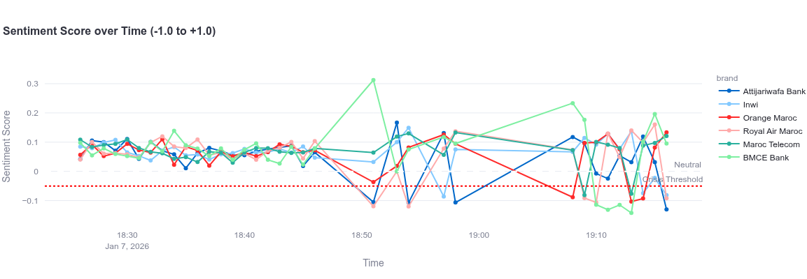

# 🛡️ Social Sentinel: Analyse de Sentiment en Temps Réel

- **Module:** Clusters Big Data & Systèmes Distribués
- **Année:** 2025/2026
- **Auteur:** [Votre Nom]

---

## 📖 Description du Projet

Ce projet implémente une architecture Big Data complète ("Kappa Architecture") pour surveiller la e-réputation des grandes entreprises marocaines (Maroc Telecom, Orange, RAM, etc.).

Le système ingère des flux de réseaux sociaux en temps réel, analyse le sentiment des messages (Positif/Négatif/Neutre) grâce au NLP, et déclenche des alertes immédiates en cas de crise (ex: chute brutale de satisfaction due à une panne réseau).

### Objectifs atteints :

- **Ingestion Haute Fréquence:** Supporte des pics de charge (mode "Burst")
- **Faible Latence:** Détection de crise en < 10 secondes
- **Visualisation:** Dashboard interactif Web (Streamlit)
- **Stockage:** Historisation complète et agrégations temporelles

---

## 🏗️ Architecture Technique

Le pipeline de données suit le flux suivant :

1. **Générateur (Python):** Simule un flux de réseaux sociaux réaliste avec des scénarios de crise pondérés
2. **Ingestion (Apache Kafka):** Tamponne les messages dans le topic `social_posts` (3 partitions)
3. **Traitement (Apache Spark Streaming):**
   - Consommation des micro-batchs
   - Nettoyage et Analyse de Sentiment (TextBlob)
   - Agrégation par fenêtres glissantes (Windowing 1 min)
4. **Stockage (Apache Cassandra):** Sauvegarde des tweets bruts et des métriques agrégées
5. **Visualisation (Streamlit + Plotly):** Interface de monitoring temps réel avec système d'alerte

---

## Démonstration & Screenshots

### 1. Dashboard en mode "Surveillance Normale"

Cette vue montre le flux de données en temps réel. On observe les volumes de posts par marque et une courbe de sentiment stable.

> *courbes évolutifs:*


### 2. Détection de Crise (Simulation)

Lorsqu'une marque (ex: Maroc Telecom) subit une vague de commentaires négatifs, le système déclenche une alerte visuelle rouge et notifie l'opérateur en moins de 5 secondes.

> *chute de la réputation: courbe en rouge "orange maroc":*


Dashboard en sa totalité:


### 3. Preuve de Stockage (Cassandra)

Vue de la base de données montrant les tweets bruts et les scores de sentiment associés, prouvant que le pipeline d'écriture fonctionne.

> *
 


---

## Installation et Démarrage

### Prérequis

- Docker (pour Kafka et Cassandra)
- Python 3.10+
- Java 11 (Requis pour Spark)

### 1. Démarrer l'Infrastructure

Assurez-vous que les conteneurs Docker tournent :

```bash
# Démarrer Cassandra
docker run --name cassandra -p 9042:9042 -d cassandra:4.1

# Vérifier Kafka (déjà installé sur votre machine/docker)
# Créer le topic si nécessaire :
docker exec -it kafka kafka-topics --create --topic social_posts --partitions 3 --bootstrap-server localhost:9092
```

### 2. Installer les dépendances Python

```bash
pip install -r requirements.txt
python -m textblob.download_corpora
```

### 3. Lancer le Pipeline

Ouvrez 3 terminaux distincts et lancez les commandes dans cet ordre :

#### Terminal 1 : Générateur de Données

```bash
python3 src/generator/post_generator_v2.py
```

Le script commencera à envoyer des messages. Une crise aléatoire sera simulée périodiquement.

#### Terminal 2 : Moteur de Traitement (Spark)

```bash
python3 src/processor/spark_processor.py
```

Attendre l'initialisation de la JVM et le message "Streaming started".

#### Terminal 3 : Dashboard Web

```bash
streamlit run src/dashboard/web_dashboard.py
```

Le dashboard s'ouvrira automatiquement dans votre navigateur (http://localhost:8501).

---

## 📂 Structure du Projet

```
sentiment-analysis/
├── config/
│   └── cassandra_schema.cql         # Schéma de la base de données
├── docs/                            # Documentation et images
├── ressources/                      # Screenshots et images du projet
├── src/
│   ├── generator/
│   │   └── post_generator.py        # Simulateur de trafic (Normal + Crise)
│   ├── processor/
│   │   └── spark_processor.py       # Pipeline ETL Spark Streaming
│   └── dashboard/
│       └── web_dashboard.py         # Interface Web Streamlit
├── requirements.txt                 # Dépendances Python
└── system_events.log                # Logs automatiques des crises détectées
```

---

## 🛠️ Difficultés Rencontrées & Solutions

| Problème | Solution |
|----------|----------|
| **Compatibilité Spark/Java:** Spark 3.5 nécessitait Java 11 | Forcer `JAVA_HOME` vers OpenJDK 11 |
| **Driver Cassandra & Python 3.12:** Erreur de compilation des extensions C | Installation en mode "Pure Python" (`CASSANDRA_DRIVER_NO_EXTENSIONS=1`) |
| **Kafka Legacy:** La librairie `kafka-python` n'était plus compatible | Remplacée par `kafka-python-ng` |
